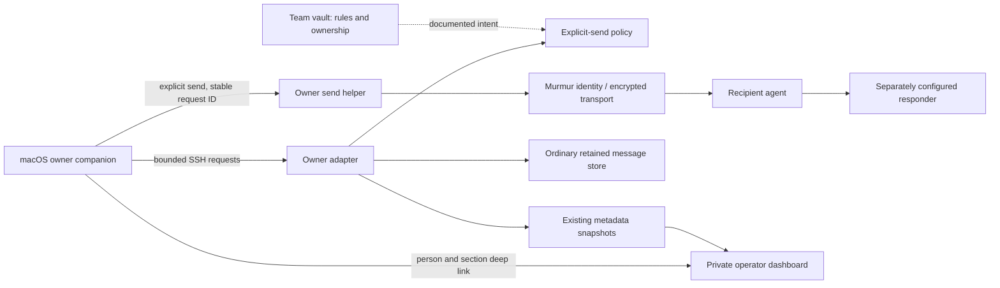

# AIM companion architecture and review guide

Review phase: 6 October 2026. Engine 2.12.0; local edition AIM 9.
This is an operator-specific macOS prototype proposed for upstream review. A PR
does not publish an app, deploy the dashboard or authorize employee access.

## What the person can do

The menu app shows configured people and agents, incoming requests and decisions,
ordinary message search, selected message text and existing approved portraits.
It opens the selected person's dashboard history or connection map. Explicit
messages go through the owner's existing server identity. A Telegram action opens
a human chat; an owner-chat action opens a verified conversation in Codex.
Neither navigation action sends a message or starts an assistant session.

Menu placement and persistent panel pinning are separate. English is the default;
Russian is selectable. Theme, pin and the recorded global shortcut survive a
restart. Local Command-comma opens Settings; Escape closes the active layer.
Digits 1–4 navigate outside editors, sheets and shortcut recording.

## Components and authority

The upstream setup package owns profile selection, pairing, service/client
configuration, doctor and update contracts. Those flows remain available in the
local tab. The AIM adapter uses the existing owner's SSH alias and server helpers;
it does not discover employee profiles, issue credentials or replace upstream
setup. `AIMOwnerRead.swift` executes the packaged query helper in memory. Its
canonical source is `team-ai-infrastructure/worldstream/scripts/mesh-comms-query.py`;
the packaged copy must match that source before a build.

The app reads existing metadata every 60 seconds; the server's metadata collector
runs every 120 seconds. These are data reads, separate from model execution.
Opening an inbox does not mark messages read. Bodies are requested on demand.
Private contours contribute status only and are excluded from general body search.
Notification deduplication retains hashes; initial/stale observations do not emit
a notification storm. Model execution retains its existing budget preflight.

Approved portraits are an owner-only read of an exact current person-to-asset
mapping. The reader validates privacy, pairing, the server allowlist, regular file
ownership, symlink refusal and size. Native decoding has an image-dimension bound.
Images remain in process memory. Missing or disallowed photos use initials; source
warnings remain visible. The feature neither imports contacts nor uploads photos.

## Links and opening

The canonical operator board is `https://content.aimindset.org/murmur/`, behind the
closed network and owner session. Dashboard navigation uses that prefix with
`view=mesh`, `section=history|map|contacts`, and an encoded exact actor ID.
`AIMCompanionModel.board` owns the app's base URL. Settings can explicitly select
the development preview at `http://127.0.0.1:8768/`. That preview requires a running
local listener and grants no remote access. It must not be advertised to colleagues
as their dashboard URL.

The existing legacy `/access` route exchanges a short-lived ticket for an owner
session and redirects to the canonical board. An expired session can leave an
already-open tab showing cached observations and fetch failures; re-enter through
the existing owner login and verify the observation timestamp. Tailnet membership
by itself is insufficient for owner access. Replacing this bridge requires a
verified owner login, not just changing links.

The `Recovery` destination is labeled **Task archive** in the dashboard: retained
work/recovery observations, separate from live person conversations. Local profile
recovery remains an upstream setup function. Cross-tool search currently navigates
to the family search surface; ordinary message search stays scoped to the owner
adapter. There is no shared search index containing everyone's private messages.

## Why the rosters differ

| Surface | Inclusion rule | Meaning of absence |
| --- | --- | --- |
| Team registry | Current and historical people with source provenance | Registry entry may be missing or outside its declared team scope |
| Operator dashboard roster | Configured human/agent bindings; wider registry available through filters | A person can exist in the team without a paired agent |
| Dashboard map | Selected kind, team, history and recent-message/exchange filters | A quiet or private line can be hidden by activity/privacy filters |
| AIM companion People | Ordinary configured peers, exact current owner bindings, plus an explicit status-only private contour | Retired, self/local, unpaired and unrelated people are excluded |
| Transport peer list | Configured cryptographic peers for the selected identity | A peer has no automatic human or responder association |

Resolve `person_id` and `agent_id` through evidence-bearing bindings, never through
display-name similarity. Show inclusion reason, source, observed time and hidden
filter counts. An ownership edge associates a person with an agent. A message edge
needs observed envelopes and directional counts. Repository co-authorship is a
third evidence type. None proves current availability or authorization to act.

## Permission layers today

| Layer | Authority and enforcement | What the app setting does |
| --- | --- | --- |
| Transport | Existing identity, broker configuration, paired keys | Does not add peers or credentials |
| Operator UI | Closed network plus owner-session gate | Opens an existing owner surface |
| Explicit companion send | Server `companion-policy.json`, revision check and audit | Can disable this send path |
| Attached context | `message_only` or owner-authored `approved_brief` | Brief attachment is an explicit send-time choice with matching revision |
| Contact preferences | `review_required` / `trusted_contact`; concise/friendly/formal | Describes preference; does not grant autonomous execution or rewrite manual text |
| Responder | Existing wake configuration and independently observed wake status | Shows assigned handler; does not create, resume or authorize one |
| Files/resources | Actual OS, broker/profile/lease and source ACLs | Reports that filesystem access is not managed here |
| Private contour | Separate binding and privacy rules | Status only; no ordinary compose/body-search path |

The explicit-send policy has its own lock, atomic writes, restrictive mode,
optimistic revision and audit digest. Its scope is **companion explicit sends
only**. Other MCP clients, automatic responders and Telegram have separate owners
and enforcement. A successful policy update cannot grant access through those
paths. Governance and runbooks belong in the vault; credentials and live enforced
grants belong with the runtime authority. The app currently has no team-wide RBAC
editor and no verified common grant store across those authorities.

## Message and question lifecycle

1. Select a person, then an exact writable agent. Confirm the current explicit-send
   policy and compose the text; attach an approved brief only by explicit choice.
2. Generate one stable request ID. The server verifies sender/recipient, records
   intent durably and enqueues through the existing identity. An ambiguous failure
   must be reconciled by ID rather than retried under a new ID.
3. Display queued, transport ACK, observed responder result and semantic reply as
   separate evidence. ACK proves transport delivery; it does not close a question.
4. A question records exact source message ID, conversation, last message time,
   review time, responsible party, next step and outcome evidence. “Reviewed” and
   “completed” remain distinct. The decision queue can be older than an incoming
   message, so keep dates visible.
5. Continue in an exact verified owner chat. An unassigned responder needs an
   explicit routing decision. Opening Codex alone does not transfer task context.

## Proposed next phase for review

These capabilities are proposals; no tier or grant is applied by this PR.

- Unify the person/agent registry contract across app and dashboard, keeping source
  provenance, inclusion reasons, historical state and private status exceptions.
- Replace the operator-specific adapter with an explicitly selected server profile
  and capability negotiation. Keep credential custody in upstream setup/runtime.
- Model an access request as principal person/agent, resource, allowed actions,
  context scope, purpose, issuer, approval, expiry, revision and enforcement receipt.
  Candidate UI presets: status view, approved message/brief, approved project read,
  bounded execution. A preset becomes effective only after its authority confirms
  the corresponding scoped grant. New grants default to absent.
- Provide a separate team projection with recipient-scoped authorization and search.
  The current owner board must not be opened to the whole team to achieve this.
- Define one responder owner per conversation, routing evidence and manual fallback;
  surface budget deferral and dead-letter state with a clear next step.
- Agree upstream scope: reusable setup/companion contracts and navigation can be
  separated from AIM branding, fixed owner host and catalog/owner-chat bindings.

Review questions: which grant authority should issue each scope; what roster
contract should upstream own; where should the selected server profile live; what
can a team recipient read; which responder owns each conversation; which changes
belong upstream versus an operator adapter; how should grant revocation and reply
receipts be verified across clients?

## Acceptance and limits

See `AIM-QA.md` for exact native acceptance and `AIM-EDITION.md` for the edition
history/build recipe. Local AIM 9 acceptance is bound to source commit
`146915fbb48b2dc29290c77ee2a05481d7b1fa0e`, before this documentation update.
No upstream CI result, notarized release, new-machine installation, reboot/login
behavior or team authorization is implied by that local result. Dashboard and
server adapter revisions can differ from the installed app: observe each source
independently before claiming end-to-end deployment.
