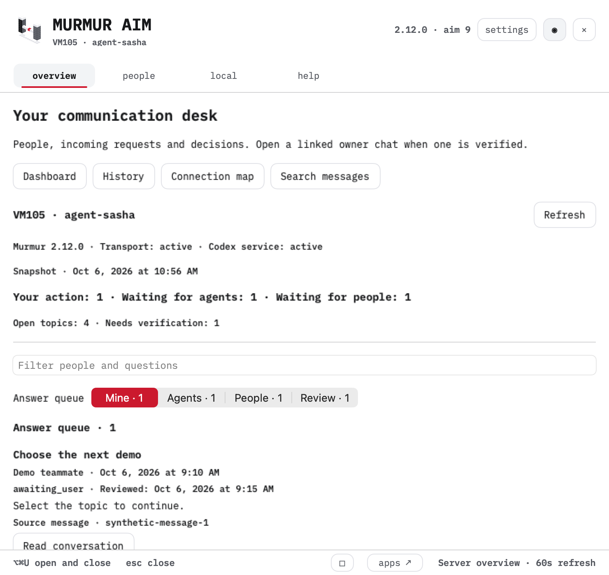
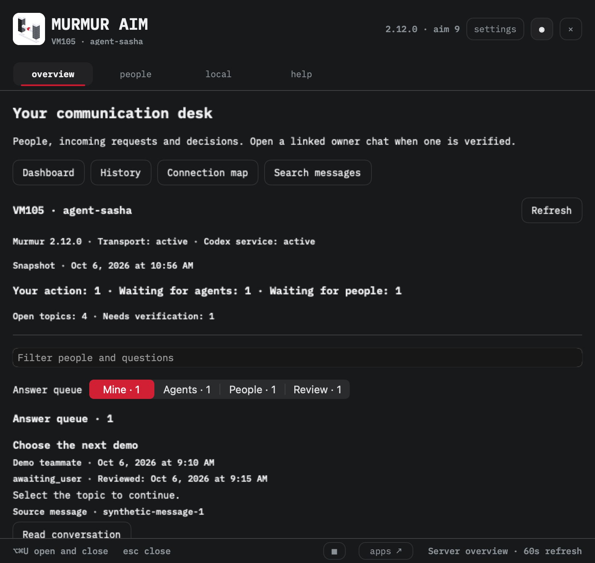

# AIM edition acceptance · 29 September 2026

## AIM 9 local acceptance · 6 October 2026

Installed source: `146915fbb48b2dc29290c77ee2a05481d7b1fa0e`, clean before build.
Engine 2.12.0; arm64; binary SHA256
`a8cba99149df089681c4677984966922e70f00cd1fcf27c13863faf056602d1c`.
This section supersedes the earlier acceptance counts for that installed edition.

- `packaging/verify-aim.py`: shared exports and fonts match the receipt.
- `packaging/avatar-query-checks.py`: 8 Python privacy/allowlist checks pass.
- `MurmurMenuBar --aim-check-avatars`: 18 checks pass, including an actual
  NSHostingView photograph render with synthetic image pixels and refusal cases.
- `MurmurProbeChecks contracts/setup/v1/fixtures`: 513 checks pass.
- Build/install receipt: 7 bundled native bridge checks, 1128 runtime files,
  deep/strict ad-hoc signature verification, zero packaged Python bytecode.
- Existing approved owner asset read verified without disk export. Private,
  missing, unpaired and invalid references refuse image access or use initials.
- Pin, theme, language, server selection and global shortcut preserved on install.
- Fresh light/dark fixture previews contain fictional content only. The installed
  Overview was inspected; live People-card avatar pixels were not independently
  accepted because shared-machine foreground coordination interrupted that pass.

Synthetic previews (Overview, not live recipient data):

Login/reboot, menu-manager/notch occlusion, downloaded first-open acceptance and
remote semantic responder round-trip remain unverified. Documentation commits
after the installed source do not identify a rebuilt or released app. No app or
dashboard deployment and no access grant are covered by these checks.

The existing macOS CI builds the native consumer and runs its canonical fixture
gate. Maintainers should additionally run the AIM asset, Python reader and native
avatar commands above after that build. A proposed workflow step was removed from
this PR because the contributor's GitHub OAuth credential lacks `workflow` scope;
no executed CI coverage for those additional commands is claimed.

Upstream CI review found 59 vocabulary violations across 28 English/Russian
presentation entries. The follow-up changes values to Identity, Contact,
Assistant and Wake-up according to `contracts/vocabulary.md`; technical IDs,
localization keys, routing and permission behavior remain unchanged. The four
vocabulary tests pass locally. This follow-up is separate from the installed AIM 9
artifact above; an app replacement or release is not implied.

## Initial acceptance

- Current design N1, arm64, upstream app source from main after v2.12.0.
- Release Swift build completed on the target Mac.
- 494 upstream native contract/fixture checks passed, including profile identity,
  pairing, raw-credential refusal, status truth and CLI mutation boundaries.
- 7 native bundled-helper checks passed in disposable homes; real argv and PID
  preservation, environment isolation and incomplete runtime refusal checked.
- Official 2.12.0 runtime archive SHA256:
  `ed8c0005ecb3740d1cb0d1711ebc14e69b904180ea4ee2524172fe38182a5927`.
  All 1128 payload files verified against its manifest. Engine commit:
  `e7f389c97146dd305a19099eeb1ea00eda56c423`.
- Shared AIM source hashes and bundled Plex assets checked. No private profile or
  inbox was copied into the source or app. Transport code is upstream.
- Offscreen welcome, settings and help rendered at 740 × 700. Welcome/settings
  visually inspected; shared-header mark overlap corrected. Header order,
  footer and typography match the N1 reference. No live window was shown for QA.
- App is ad-hoc signed. Signature and bundled CLI checked before installation.

Control wiring: header settings selects Settings; shared tabs select Home/Help;
pin sets AIMSurface.pinned; header close, Escape, Command-W and menu click route
to AIMSurface.close; footer opens the public apps catalog. Existing preferences
menu preserves language, login toggle and pairing entry. These paths are inspected
in source and rendered offscreen. A full live mouse/keyboard control walk, TCC,
login/reboot, pairing and real automatic agent wake are not verified in this pass.
The installation starts with --background, not a forced window, during the call.

Intentional first-edition exceptions: existing fixed global shortcut is retained;
menu-bar mode chooser and hotkey recorder remain future work. The same family
mark is used for this personal fork; no suite-wide mark or design-system source
was edited. No public site or release was published.
